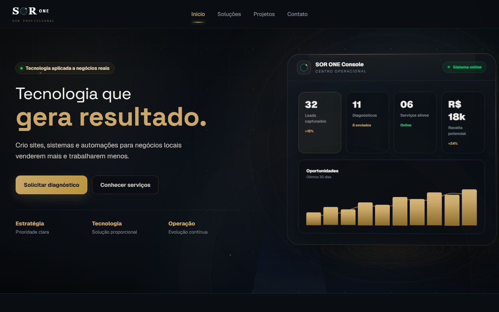
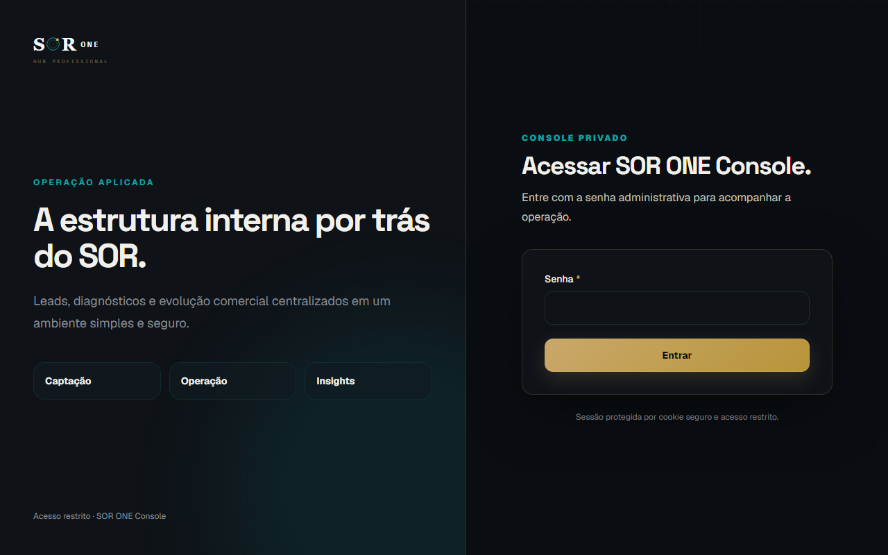

# SOR OS

Site portfólio e sistema operacional da SOR OS Soluções Digitais — agência de desenvolvimento freelancer. O site público apresenta projetos, serviços e formulário de diagnóstico. O console interno gerencia leads captados.


## Demo

| | URL |
|---|---|
| **Site público** | https://sor-one-internal.vercel.app/ |
| **Projetos** | https://sor-one-internal.vercel.app/projetos |
| **Soluções** | https://sor-one-internal.vercel.app/solucoes |
| **Diagnóstico** | https://sor-one-internal.vercel.app/diagnostico |
| **Console admin** | https://sor-one-internal.vercel.app/console |

## Funcionalidades

### Site público

- Home com métricas operacionais, proposta de valor e diagnóstico de dores
- Página de projetos com demos ao vivo e links para GitHub
- Página de soluções (landing pages, cardápios, catálogos, agendamentos, SaaS)
- Formulário de diagnóstico digital com captura de lead
- Página de contato
- SEO técnico completo: metadata por página, OpenGraph, robots.txt, sitemap.xml dinâmico

### Console operacional (admin)

- Login protegido por sessão
- Dashboard com visão geral de leads
- Lista de leads capturados pelo diagnóstico com status e dados de contato

## Tecnologias

**Frontend**
- Next.js 15 + React + TypeScript
- CSS com Tailwind (sistema de componentes próprio)
- Deploy: Vercel

**Backend / Dados**
- Supabase (PostgreSQL gerenciado)
- API Routes do Next.js
- Autenticação via cookie de sessão

**SEO**
- Metadata API do Next.js por rota
- `robots.ts` e `sitemap.ts` gerados dinamicamente
- OpenGraph para compartilhamento em redes sociais

## Screenshots

### Home — desktop


### Home — mobile


### Projetos


### Diagnóstico


### Console — leads


## Como rodar localmente

```bash
git clone https://github.com/RhanielRodri/sor-one-internal.git
cd sor-one-internal
npm install
```

`.env.local`:

```env
NEXT_PUBLIC_SUPABASE_URL=
NEXT_PUBLIC_SUPABASE_ANON_KEY=
SUPABASE_SERVICE_ROLE_KEY=
ADMIN_SECRET=
```

```bash
npm run dev
```

Abre em `http://localhost:3000`.

## O que este projeto demonstra

- **SEO técnico via Next.js Metadata API**: cada rota tem title, description e OpenGraph distintos; `sitemap.ts` e `robots.ts` gerados dinamicamente
- **App Router com route groups**: separação entre rotas públicas `(public)` e console `console/` com middlewares distintos
- **Captura de leads com Supabase**: formulário de diagnóstico persiste no banco sem backend dedicado, usando API Routes do Next.js
- **Autenticação stateless com cookie httpOnly**: console protegido sem biblioteca de auth, usando apenas `cookies()` do Next.js
- **TypeScript end-to-end**: tipos definidos para dados de serviços, leads e métricas, sem any implícito

## Autor

Desenvolvido por Rhaniel Rodrigues.

GitHub: https://github.com/RhanielRodri
